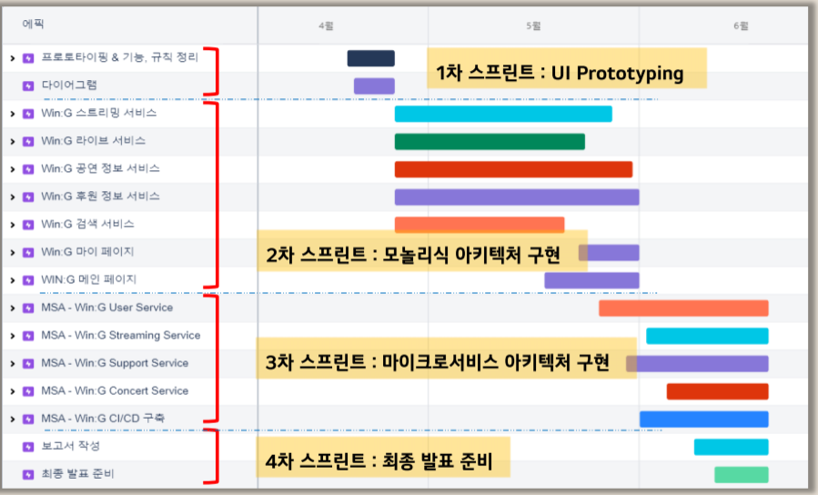
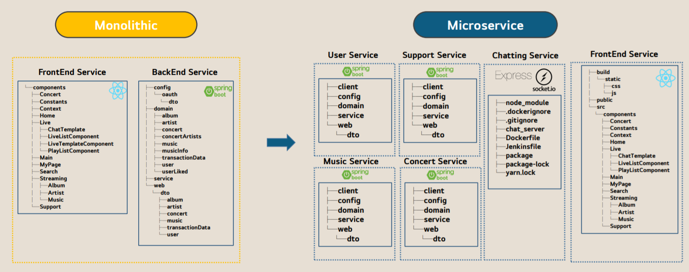
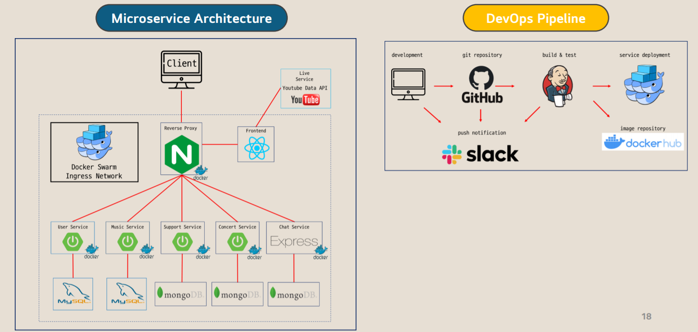
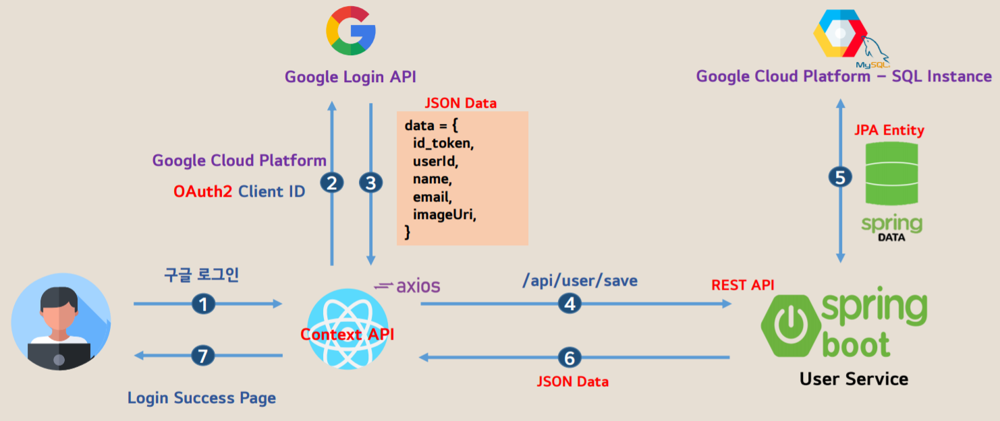
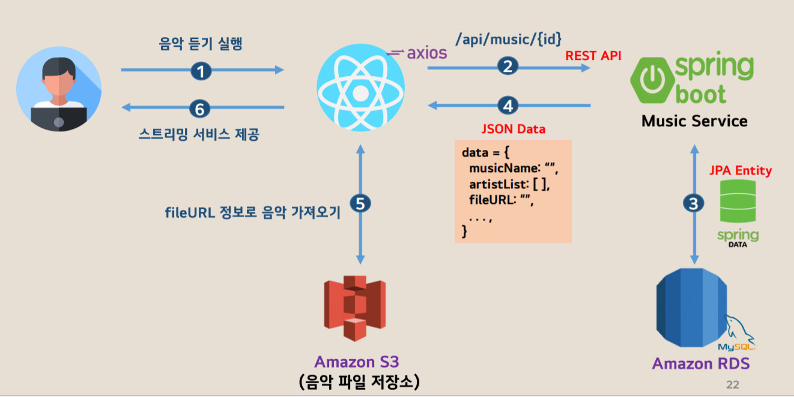
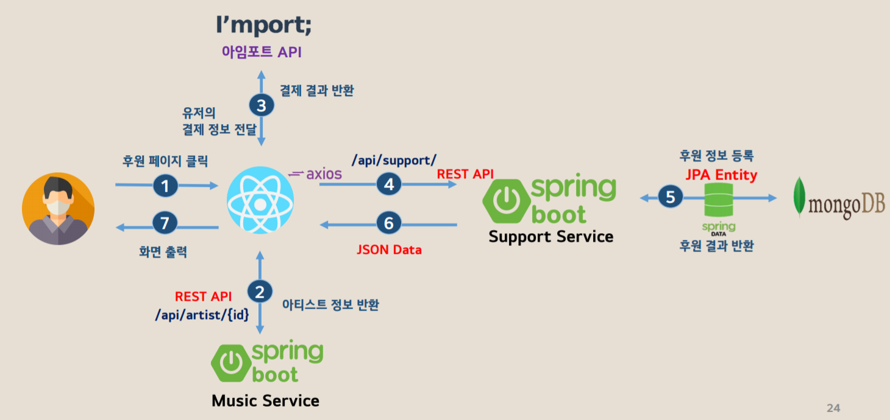
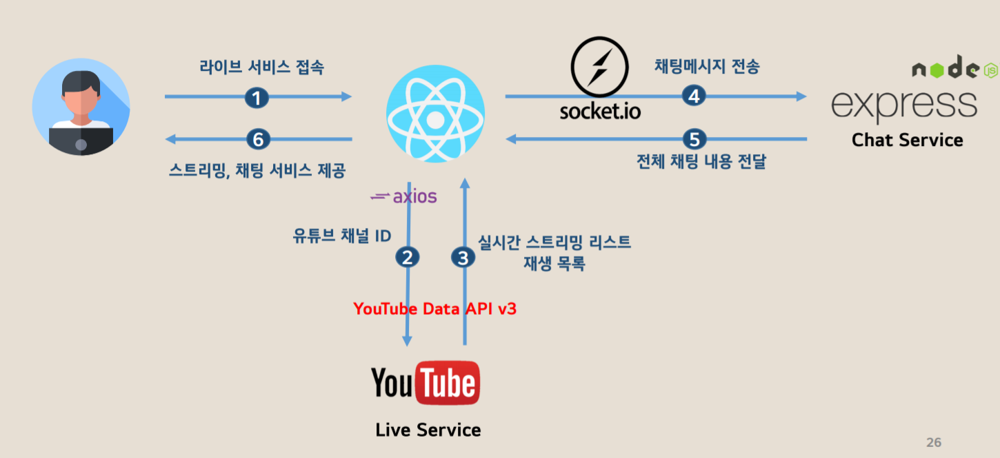
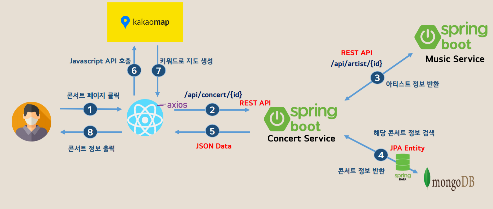

# wing-project

>  클라우드 기반 마이크로 서비스 전문가 양성 과정 A반 3조 - 노말(NoTalk) 
>
>  인디 음악 플랫폼 Win:G

## 기획 의도

마이크로서비스 전문가 양성과정을 통해 배운 Infra, Front-end, Back-end, CI/CD 내용을 충실히 반영하며, 마이크로서비스 아키텍처에 적합한 Win:G 프로젝트를 기획하였습니다. 

Win:G란 뮤지션들에게 날개를 달아준다는 뜻의 Wing과 목표를 이루는 이룬다는 뜻의 Win + Goal을 합쳐서 만들었습니다.

인디 뮤지션들이 편향된 음악 시장에서 음악 활동을 하면서 어려움을 느낀다는 것과 사용자들이 본인들이 좋아하는 뮤지션들을 접하기 힘들다는 문제점을 해결하기 위해 Win:G 플랫폼을 기획했습니다. 

 

## 프로젝트 소개

Win:G는 인디 뮤지션과 대중들의 만남의 장을 만드는 것을 목표로 하여 음원 스트리밍 서비스, 실시간 Live 서비스, 인디 뮤지션 후원 서비스, 공연 정보 서비스를 제공하는 서비스 플랫폼입니다.

사용자들은 Win:G를 통해 개성 있고 실력 있는 인디 뮤지션들의 음악을 들을 수 있고, 언제 어디서든 인디 뮤지션들의 실시간 공연 영상을 시청할 수 있습니다. 

그리고 좋은 음악이 있지만 열악한 음악 환경 때문에 음반 제작이 힘든 뮤지션들은 후원 서비스를 통해 후원을 받을 수 있으며, 뮤지션별 공연 날짜 및 공연 정보 확인이 가능합니다. Win:G는 뮤지션과 사용자들의 즐거운 놀이터를 목표로 합니다.

 

## 팀원 소개

|        | **역할(정)** | **역할(부)** | **담당 업무**                 |
| ------ | ------------ | ------------ | ----------------------------- |
| 이종화 | Full-Stack   | Full-Stack   | Music Service, CI/CD          |
| 이대희 | Front-End    | Back-End     | Concert Service               |
| 이민기 | Back-End     | Front-End    | User Service                  |
| 탁성건 | Back-End     | Front-End    | Support Service, Live Service |

 

## 기술 스택

| Front-End  |  Back-End  | Database |    DevOps    |                             Wiki                             |                        Issue Tracking                        |
| :--------: | :--------: | :------: | :----------: | :----------------------------------------------------------: | :----------------------------------------------------------: |
| JavaScript | SpringBoot |  MySQL   |   Jenkins    | [Confluence](https://wingproject.atlassian.net/wiki/spaces/WP/overview) |                            GitHub                            |
|   React    |  Node.js   | mongoDB  | Docker Swarm |                                                              | [Jira](https://wingproject.atlassian.net/jira/software/projects/WP/boards/1/roadmap) |

 

## 서비스 

|           |        User        | Music Streaming |    Live&Chatting    |  Concert   |  Support   |
| :-------: | :----------------: | :-------------: | :-----------------: | :--------: | :--------: |
| Front-End |       React        |      React      |        React        |   React    |   React    |
| Back-End  |     SpringBoot     |   SpringBoot    | SpringBoot, Node.js | SpringBoot | SpringBoot |
| Database  |       MySQL        |      MySQL      |        MySQL        |  mongoDB   |  mongoDB   |
| Open API  |  Google Login API  |      React      |   YouTube Data v3   | Kakao Map  |  I'mport   |
|    ETC    | GCP - SQL Instance | AWS RDS, AWS S3 |      Socket.io      |            |            |

 

## 서비스 특징

- 마이크로서비스 아키텍처
- Restful API 

  
 

## 로드맵

 

 

## Monolithic to Microservice Migration

 

## **Microservice** **Architecture & DevOps Pipeline**

 

 

## 서비스 흐름도

 

#### 유저 로그인 서비스

 

 

#### 스트리밍 서비스

 

 

#### 후원 서비스

 

 

#### 라이브 & 채팅 서비스

 

 

#### 콘서트 서비스

 

 

## 발표 및 시연 영상

#### [발표 영상](https://www.youtube.com/watch?v=AP-bvE8h158)

#### 시연 영상

#### [발표 자료](https://drive.google.com/file/d/1oiEn9oTnthmn2k0WdcGBAOR_HgqIo5HC/view?usp=sharing)

 

## 후기

- 이종화

  6개월간 클라우드부터 웹 개발, MSA 까지 아주 많은 것을 배웠습니다. 하지만 배운 내용을 깊이 이해하고 능숙하게 다룰 수 있는 경지에 오르지는 못했습니다. 변명이지만, 마치 밥은 많이 먹었으나 소화할 시간이 부족했고, 운동하며 근육을 만드는 시간이 부족했다고 비유할 수 있습니다.  

  과정이 끝났으니 배운 내용을 바탕으로 개인 프로젝트를 진행할 계획입니다. 교육을 받으며 배운 내용을 프로젝트에 적용하기 급급했던 것들을 곱씹으며 확실하게 제 것으로 만들기 위해서입니다. 그리고 TDD 라든지, 클린 코드 라든지, 쿠버네티스 라든지 미처 시도하지 못했던 것들을 해볼 생각입니다. 본 과정에서 프로젝트를 하며 프론트엔드, 백엔드, 인프라까지 모두 경험했기 때문에 자신감이 넘치네요. 

  개발자로서 성장하기 위한 아주 유의미한 시간이었습니다. 3조 우리 팀원들이 빡빡한 시간 동안 쉽지 않은 프로젝트를 완성하느라 고생 많았고 잘 해줘서 고맙습니다. 강사님, 매니저님 교육과정 동안 잘 배울 수 있도록 해주셔서 감사합니다. 마지막으로 프로젝트 진행에 대한 조언, 그리고 개발자로서 성장할 수 있도록 양질의 조언을 해주신 멘토님 감사합니다. 저는 이만 ㅎㅎ!

  

- 이대희

  처음 이 과정을 들어오면서 열심히 해야겠다는 마음과는 달리 프론트엔드부터 백엔드, 그리고 인프라까지 개발의 모든 부분을 배우면서 내가 프로젝트를 잘 수행할 수 있을까 걱정이 있었습니다. 아이디어 기획, 요구사항 분석 및 명세서 작성, UI Prototype 제작, 프론트엔드 & 백엔드 개발, 배포까지 프로젝트가 진행되면서 수업 시간에  이해한 것도 실제로 개발해보니 부족하다는 것을 느꼈고 팀원들과 다양한 상황에서 기술에 관해 얘기하다 보니 같이 성장하는 느낌을 받았습니다.     

  여러 가지 협업 툴을 사용했는데 처음엔 각각의 도구들이 어떤 역할을 하고 어떤 편의성을 주는지 정확히  인지하지 못했습니다. 데일리 스크럼도 처음엔 어떤 것을 말해야 하나라는 부담이 있었습니다. 시간이 지나 개발이 어느 정도 진행된 후에는 협업 도구들이 상황마다 유용 적이고 변화에 대응하는 데 효율적이라고  느꼈습니다. 또, 데일리 스크럼에서는 하나의 팀이라는  의식과 즉각적인 피드백, 신뢰 형성을 느꼈습니다.     

  비록, 기간이 짧아 계획했던 서비스나 기술적으로 도입하지  못한 것들이 있어 아쉬움이 남지만, 좋은 개발 문화란 이런 것이라고 느끼게 해준 팀원들에게 우선  고맙고 항상 도움 주신 강사님과 매니저님 그리고 방향을 잃지 않게 도와주신 멘토님에게도 감사의 말씀을 전합니다.  

  

- 이민기

  대학교에서 배운 전공 지식이 실무에 어떻게 쓰이는지 항상 궁금했는데 인프라부터 프론트, 백엔드까지 학습하며 프로젝트를 통해 이것들을 다뤄볼 수 있어서 좋았습니다.       

  다른 html, css, jsp 정도만 가르쳐주는 다른 국비  교육들과 달리 React, SpringBoot, JPA, Docker, AWS와 같은 기술들을 배우고 DB 설계부터 배포까지 모놀리식에서 마이크로서비스 마이그레이션을 해보는 프로젝트에 적용하는 좋은 경험을 할  수 있었습니다.     

  좋은 팀원들과 멘토님을 만난 것이 가장 큰 행운이었습니다. 팀원들  모두가 열심히 성실하게 참여한 덕분에 크게 다툰 적 없이 정해진 방향에 맞게 서로의 이견을 조율해가며 프로젝트를 완성할 수 있었습니다. 바쁘신 와중에도 화상 회의로 프로젝트 진행 방향에 대해 조언을 주신 멘토님께 감사합니다.     

  6개월 동안 배운 교육내용과 이를 프로젝트에 적용해보며 많은  것을 배울 수 있었습니다. 교육이 끝난 뒤에도 프로그래밍 학습을 게을리하지 않고, 좋은 개발자가 되기 위해 노력하겠습니다.  

  

- 탁성건

  팀원들과 협업하여 요구사항 분석, UI 프로토타이핑부터 코드 개발, 테스트 및 배포까지의 단계를 진행하면서 소프트웨어 개발에 대해 많은 것을 배울 수 있었습니다. 무엇보다 프로젝트를 모놀리식 아키텍처에서 마이크로서비스 아키텍처로 전환하는 과정에서 MSA의 장점인 높은 확장성과 손쉬운 배포를 직접 경험할 수 있었으며, 개별적인 서비스들이 모여서 하나의 서비스처럼 동작하는 것이 인상 깊었습니다. 

  팀원 각자가 관심 있는 부분을 조금 더 깊이 공부하고 알려주는 기술 공유 시간을 가졌고, 애자일 방법론을 채택해 더욱 체계적으로 개발할 수 있었던 것 같습니다. 스프린트를 나눠서 개발하고, 데일리 스크럼을 통해 진행 상황을 인지하는 등 기술적인 부분뿐만 아니라 협업 문화도 경험해 볼 수 있어서 좋았습니다. 프로젝트 기간이 짧아 쿠버네티스, ELK Stack 등 도입하지 못한 부분들이 있어 아쉬움이 남지만 여기서 배운 내용을 토대로 새로운 기술을 탐구하고 도전해 나갈 것입니다. 

  6개월간의 교육 동안 많은 도움을 주신 멘토님, 강사님, 매니저님 그리고 같은 반 동료분들에게 감사하다는 말을 전하고 싶습니다.
